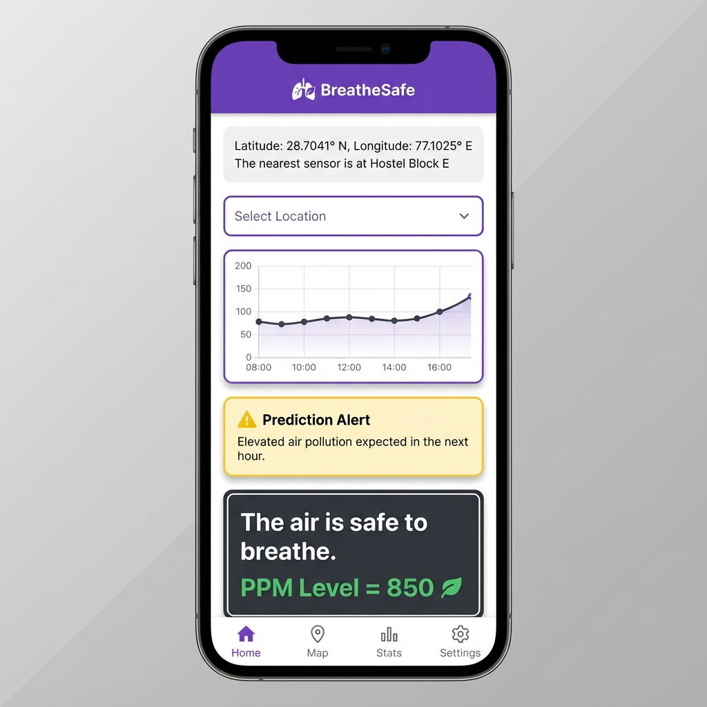

# Breathe Safe - Air Quality Monitoring App

Breathe Safe is a Progresive Web Application (PWA) designed to provide real-time air quality monitoring and health advisories. It connects to distributed IoT sensors to display Particulate Matter (PPM) levels and uses smart algorithms to predict future air quality.



## Key Features

*   **Real-Time Monitoring**: Fetches live PPM data from ThingSpeak channels.
*   **Geolocation**: Automatically autodetects your location to find the nearest sensor.
*   **Smart Alerts**: Color-coded status updates (Safe, Warning, Critical) based on current air quality.
*   **Anomaly Prediction**: **[NEW]** Predicts high pollution levels for the next hour using Isolation Forests and time-of-day patterns, alerting you before the air gets bad.
*   **Interactive Maps & Charts**: View sensor locations and historical trends.

## How to Run

1.  Clone the repository.
2.  Install dependencies:
    ```bash
    npm install
    ```
3.  Start the application:
    ```bash
    npm start
    ```
4.  Open [http://localhost:3000](http://localhost:3000) to view it in your browser.

## Technologies Used

*   React.js
*   Grommet UI
*   ThingSpeak API
*   HTML5 Geolocation
